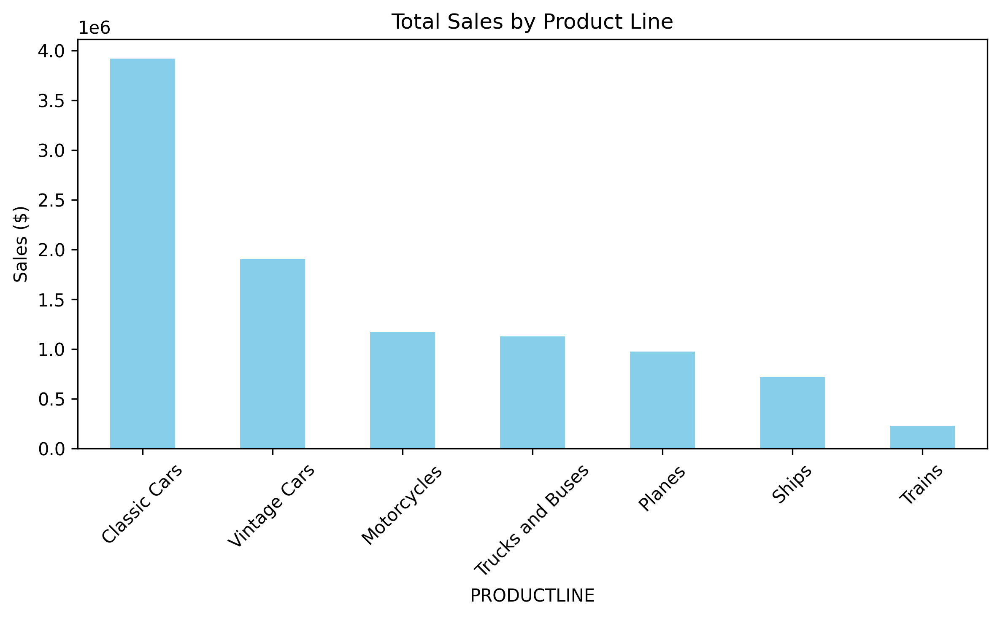
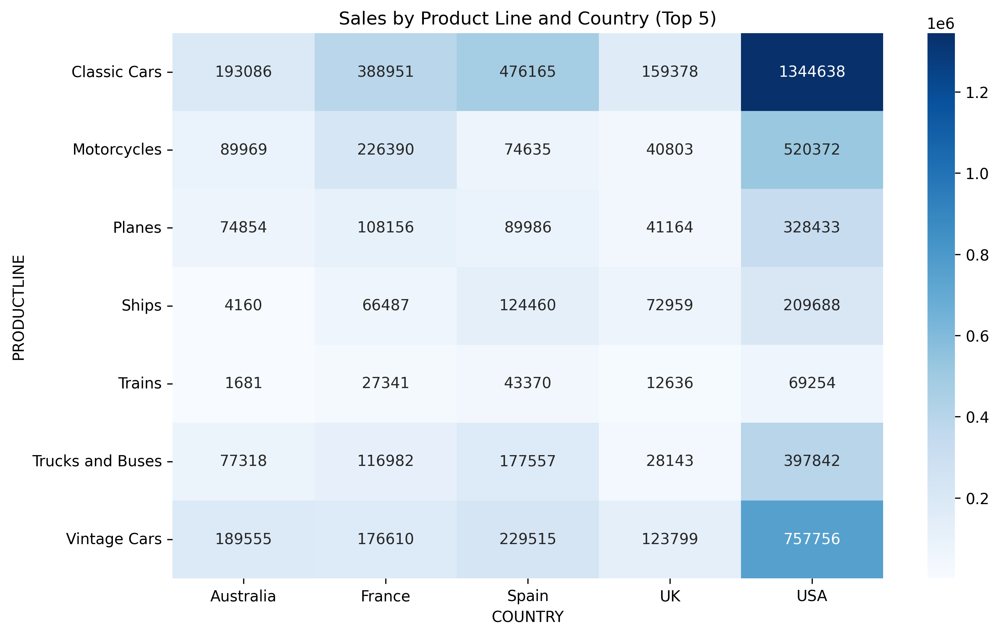
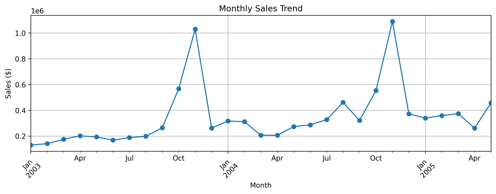
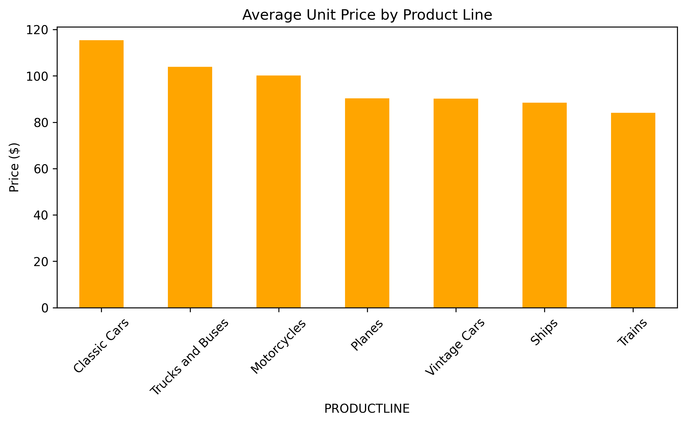
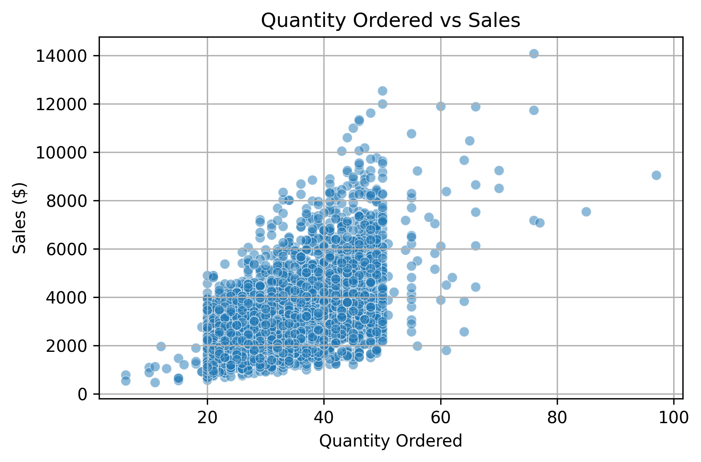

# 📊 Sales Data Visualization

This project explores and visualizes real sales data for multiple product lines across various countries and months.  
The analysis focuses on uncovering trends, pricing behavior, geographic patterns, and product performance.

📅 **Project date:** April 17, 2022  
🧰 **Tools used:** Python, Pandas, Matplotlib, Seaborn, Jupyter Notebook

---

## 💼 Business Questions Addressed

- What product lines generate the highest revenue?
- How do sales differ across top-performing countries?
- Is there a monthly trend or seasonality in sales?
- What is the average unit price per product line?
- Is there a correlation between units sold and revenue?

---

## 📈 Visualizations & Insights

### 1. Total Sales by Product Line
> Classic Cars and Motorcycles are the top-performing categories by revenue.

---

### 2. Sales by Product Line and Country (Top 5)
> Sales vary significantly by geography. Classic Cars dominate in multiple countries.

---

### 3. Monthly Sales Trend
> Peaks in December indicate potential holiday-driven sales cycles.

---

### 4. Average Unit Price by Product Line
> Planes and Ships have the highest average unit prices, impacting margins.

---

### 5. Quantity Ordered vs. Sales
> The expected positive correlation is observed, with some outliers.

---

## 📁 Dataset

The dataset contains order-level records with columns such as:
- `ORDERDATE`, `PRODUCTLINE`, `SALES`, `QUANTITYORDERED`, `COUNTRY`, `CUSTOMERNAME`, etc.

Source: [Kaggle – Sample Sales Data](https://www.kaggle.com/datasets/kyanyoga/sample-sales-data)

---

## 🧠 Summary

This project demonstrates exploratory data analysis (EDA) using real-world business sales data.  
The insights help understand product pricing, geographic performance, and temporal sales trends.
